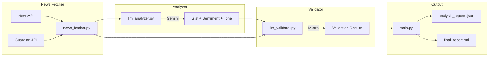

ARCHITECTURE:

PROMPT 1 - Building the News Analyzer prompt:
You are a Senior Software Engineer. 

Your task is to build a product which does news analysis using dual LLMs.

Below are the task details:
Real-world equivalent: Build a fact-checking pipeline where analysis from one LLM is validated by another.

Task:
Fetch recent news about Indian politics, analyze each article for:
Gist: 1-2 sentence summary of the news
Sentiment: positive/negative/neutral
Tone: urgent/analytical/satirical/balanced (etc.)
Then validate the analysis with a second LLM.

Workflow:
Fetch 10–15 articles from NewsAPI (topic: "India politics" or "India government")
Analyze with LLM#1 (Gemini): Generate gist + sentiment + tone
Validate with LLM#2 (OpenRouter/Mistral): "Does the analysis match the article? Any errors?"
Save final output (JSON + readable Markdown report)
Output format (final_report.md)

Create a PLAN by spliting the task into 4 agents.
Agent 1 - handles the setup of news api and guardian api set up. In short, sets up the source
Agent 2 - setups the llm_analyzer.py which will use gemini model. It's a combination of Gemini reasoning + prompt engineering
LLM analyzer gets the input from both news api and guardian API.
Then, performs an analysis on both of them.
Agent 3 - setups the llm_validator.py. It will use Mistral 7b instruct model. 
LLM validator gets the output from LLM analyzer and the news api + guardian api for validation.
Agent 4 - setups the main.py which is the orchestrator.

What's already done?
- All the required APIs are setup in the .env file.
Following are the variable names:-
For LLMs -> OPEN_ROUTER_API, GEMINI_API_KEY
For news -> NEWS_API_KEY, GUARDIAN_API_KEY
- All the required files are created.

PROMPT 2 - Building the test cases for the News Analyzer:
Create 5 test cases.
Location: test/test_analyzer.py

Test 1: test_truncate_content
Purpose: Verify content truncation works correctly
Short content (< 4000 chars) should remain unchanged
Long content (> 4000 chars) should be truncated with "... [truncated]" suffix

Test 2: test_article_normalization
Purpose: Verify articles from different APIs are normalized to same format
Mock NewsAPI response should produce correct normalized article
All required fields present: title, source, url, published_at, content, api_source

Test 3: test_analysis_output_format
Purpose: Verify analysis output contains all required fields
Mock analysis should contain: gist, sentiment, tone, key_entities
Sentiment must be one of: positive, negative, neutral
Tone must be one of: urgent, analytical, satirical, balanced, critical, optimistic, informative

Test 4: test_summary_stats_calculation
Purpose: Verify statistics are calculated correctly
Given sample articles with known sentiments
Stats should correctly count: positive, negative, neutral
Success/fail counts should be accurate

Test 5: test_validation_output_format
Purpose: Verify validation output contains all required fields
Mock validation should contain: is_valid, validation_symbol, justification, suggested_corrections
validation_symbol should be "[VALID]" or "[INVALID]" based on is_valid

PROMPT 3 - README.md
Write details in the README.md file.
- A short summary on what the project is
- File structure and about the files
- How to setup
 - the rquired api keys
 - setup and test commands